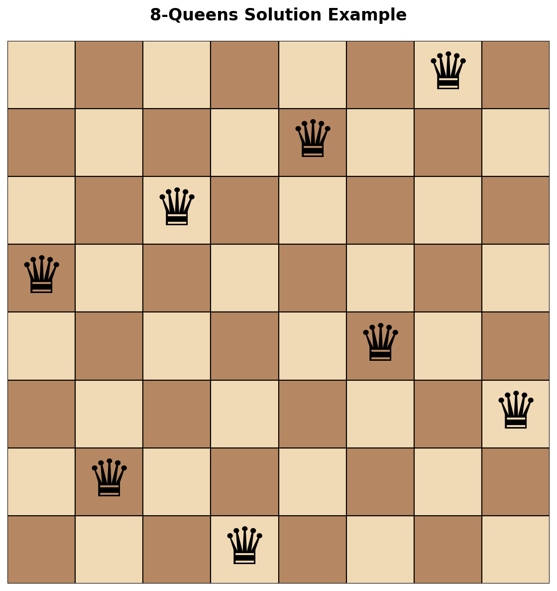
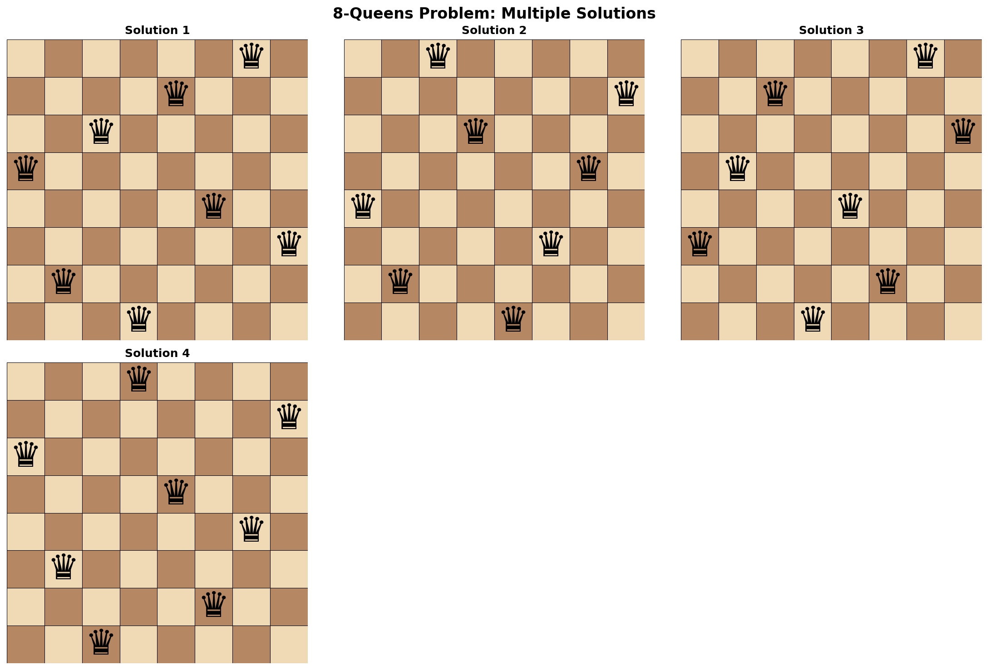
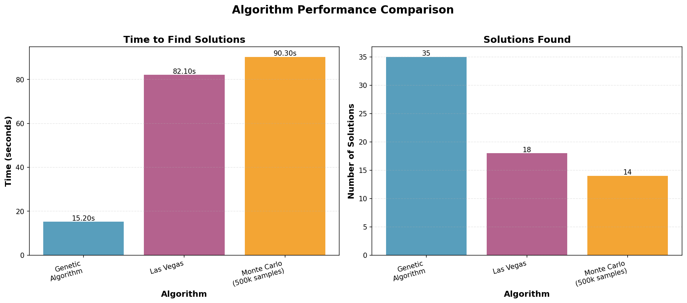
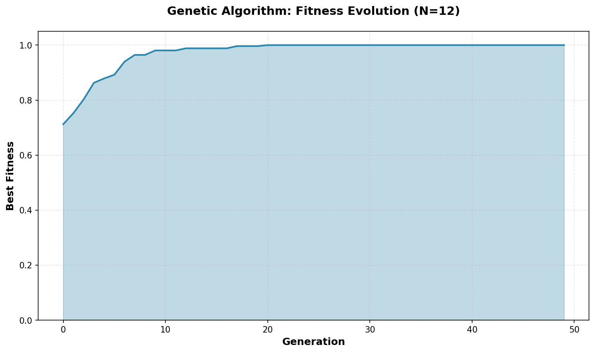
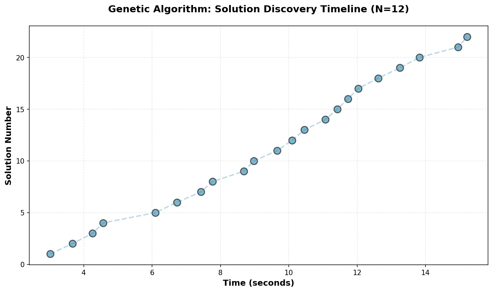

# N-Queens Problem Solver

A Python implementation of multiple algorithmic approaches to solve the N-Queens problem using genetic algorithms, Las Vegas, and Monte Carlo methods.

<p align="center">
  
</p>

## Problem Description

The N-Queens problem is a classic combinatorial puzzle where the goal is to place N chess queens on an N×N chessboard such that no two queens threaten each other. This means:
- No two queens share the same row
- No two queens share the same column
- No two queens share the same diagonal

## Approach

This project implements three different algorithmic strategies:

### 1. Genetic Algorithm (Greedy Evolution)
- Uses evolutionary computation with selection, crossover, and mutation
- Maintains a population that evolves over generations
- Fitness function based on minimizing queen conflicts
- Configurable parameters: population size, generations, reproductive pool size, offspring count

### 2. Las Vegas Algorithm
- Randomized approach that guarantees correct solutions
- Keeps generating random configurations until valid solutions are found
- No predetermined runtime, but always returns correct results when found

### 3. Monte Carlo Algorithm
- Probabilistic approach that estimates solution density
- Runs a fixed number of random attempts
- Returns the probability of finding a solution

## Features

- **Flexible chromosome representation** using permutation encoding
- **Normalized fitness function** for evaluating solution quality
- **Multiple mutation strategies** for genetic diversity
- **Statistical analysis** with visualization support
- **Performance tracking** for time-to-solution metrics
- **Configurable parameters** for fine-tuning algorithm behavior
- **Professional visualizations** with chess board rendering and performance charts

## Visualizations

The project includes comprehensive visualization capabilities:

### Multiple Solutions Display
<p align="center">
  
</p>

### Performance Comparison
<p align="center">
  
</p>

### Fitness Evolution
<p align="center">
  
</p>

### Solution Discovery Timeline
<p align="center">
  
</p>

## Installation

### Prerequisites
- Python 3.11 or higher
- Conda or Mamba package manager

### Setup

1. Clone this repository:
```bash
git clone <repository-url>
cd n_queens_problem_python
```

2. Install dependencies using pip:
```bash
pip install -r requirements.txt
```

Or create the conda environment:
```bash
conda env create -f JNotebook.yml
conda activate JNotebook
```

3. Install the package in development mode (optional):
```bash
pip install -e .
```

## Usage

### Running the Genetic Algorithm

```python
from n_queens import EvolManager

# Create evolution manager for 12-Queens problem
evol_manager = EvolManager(
    genes_per_chrom=12,      # Board size (12x12)
    pop=1000,                 # Population size
    generations=50,           # Number of generations
    offspring=500             # Offspring per generation
)

# Run the genetic algorithm
evol_manager.greedy_evolution()

# Display found solutions
evol_manager.show_solutions()
```

### Running Las Vegas Algorithm

```python
# Run Las Vegas with 500,000 random attempts
evol_manager.las_vegas(500000)
evol_manager.show_solutions()
```

### Running Monte Carlo Algorithm

```python
# Estimate solution probability with 500,000 samples
probability = evol_manager.montecarlo(500000)
print(f"Solution probability: {probability}")
```

### Using Visualizations

```python
from n_queens import Chromosome, visualization
import numpy as np

# Create and visualize a solution
solution = Chromosome(np.array([3, 6, 2, 7, 1, 4, 0, 5]))
visualization.render_board(
    solution.get_positions(),
    title="8-Queens Solution",
    save_path="my_solution.png"
)

# Display multiple solutions
solutions = evol_manager.get_solutions()
visualization.render_multiple_solutions(solutions, max_display=6)

# Plot fitness evolution
fitness_history = [0.7, 0.75, 0.82, 0.88, 0.93, 0.97, 1.0]
visualization.plot_fitness_evolution(fitness_history)
```

## Project Structure

```
n_queens_problem_python/
│
├── src/
│   └── n_queens/
│       ├── __init__.py           # Package initialization
│       ├── chromosome.py         # Chromosome class implementation
│       ├── evolution_manager.py  # Evolution manager with all algorithms
│       └── visualization.py      # Visualization utilities
│
├── notebooks/
│   ├── 01_chromosome_demo.ipynb         # Chromosome class demonstrations
│   ├── 02_algorithm_comparison.ipynb    # Algorithm comparisons and benchmarks
│   └── 03_statistical_analysis.ipynb    # Statistical analysis and convergence
│
├── tests/                        # Unit tests (to be implemented)
├── docs/
│   └── images/                   # Documentation images and visualizations
├── data/
│   ├── raw/                      # Raw experimental data
│   └── processed/                # Processed results
├── results/                      # Output files and figures
│
├── generate_visualizations.py   # Script to generate documentation images
├── .gitignore                    # Git ignore file
├── requirements.txt              # Python dependencies
├── JNotebook.yml                 # Conda environment specification
└── README.md                     # This file
```

### Key Components

- **Chromosome class** (`src/n_queens/chromosome.py`): Represents a board configuration
  - `fitness()`: Evaluates solution quality (0-1, where 1 is perfect)
  - `mutual_threats()`: Counts queen conflicts
  - `make_child()`: Generates offspring through mutation
  - `print_board()`: Visualizes the board configuration

- **EvolManager class** (`src/n_queens/evolution_manager.py`): Orchestrates the evolutionary process
  - Population management
  - Selection and reproduction
  - Multiple algorithmic approaches (Genetic, Las Vegas, Monte Carlo)
  - Solution tracking and statistics

- **Visualization module** (`src/n_queens/visualization.py`): Professional visualizations
  - `render_board()`: Chess board with queen symbols ♛
  - `render_multiple_solutions()`: Grid display of multiple solutions
  - `plot_fitness_evolution()`: Fitness progression over generations
  - `plot_performance_comparison()`: Algorithm performance charts
  - `plot_solution_distribution()`: Solution discovery timeline

- **Interactive Notebooks** (`notebooks/`): Demonstrations and analysis
  - `01_chromosome_demo.ipynb`: Chromosome class usage examples
  - `02_algorithm_comparison.ipynb`: Compare all three algorithms
  - `03_statistical_analysis.ipynb`: Population statistics and convergence

## Results

The genetic algorithm typically finds multiple unique solutions for N=12 within 50 generations with a population of 1000. Performance metrics include:

- **Time to first solution**: Varies by configuration (typically 3-10 seconds for N=12)
- **Solution diversity**: Multiple unique solutions per run
- **Fitness convergence**: Population fitness improves over generations

Example output for N=12, 1000 population, 50 generations:
- ~35 unique solutions found
- First solution typically found in generation 9-15
- Time to first solution: ~3-4 seconds

## Dependencies

Key libraries (see `requirements.txt` for complete list):
- **NumPy** ≥1.24.0 - Array operations and numerical computing
- **Pandas** ≥1.5.0 - Data analysis and statistics
- **Matplotlib** ≥3.6.0 - Plotting and visualization
- **Seaborn** ≥0.11.0 - Statistical data visualization
- **SciPy** ≥1.10.0 - Scientific computing

For Jupyter notebook support:
- **IPython** ≥8.8.0
- **nbimporter** ≥0.3.4

## Algorithm Parameters

### Genetic Algorithm Configuration

- `genes_per_chrom`: Size of the chessboard (N)
- `pop`: Population size (larger = more diversity, slower)
- `generations`: Maximum number of evolution cycles
- `reproductive_pool_size`: Number of chromosomes selected for breeding (default: 80% of population)
- `offspring`: Number of children produced per generation (default: 1.5× reproductive pool)
- `mutation_rate`: Currently unused parameter for future enhancements
- `reproductive_coefficient`: Probability multiplier for selection (default: 1/3)

## Contributing

Contributions are welcome! Areas for improvement:
- Additional optimization algorithms
- Parallel processing for faster execution
- GUI for interactive visualization
- Support for constraint variations

## License

[Specify your license here]

## Author

[Your name/organization]

## References

- N-Queens Problem: https://en.wikipedia.org/wiki/Eight_queens_puzzle
- Genetic Algorithms: https://en.wikipedia.org/wiki/Genetic_algorithm
